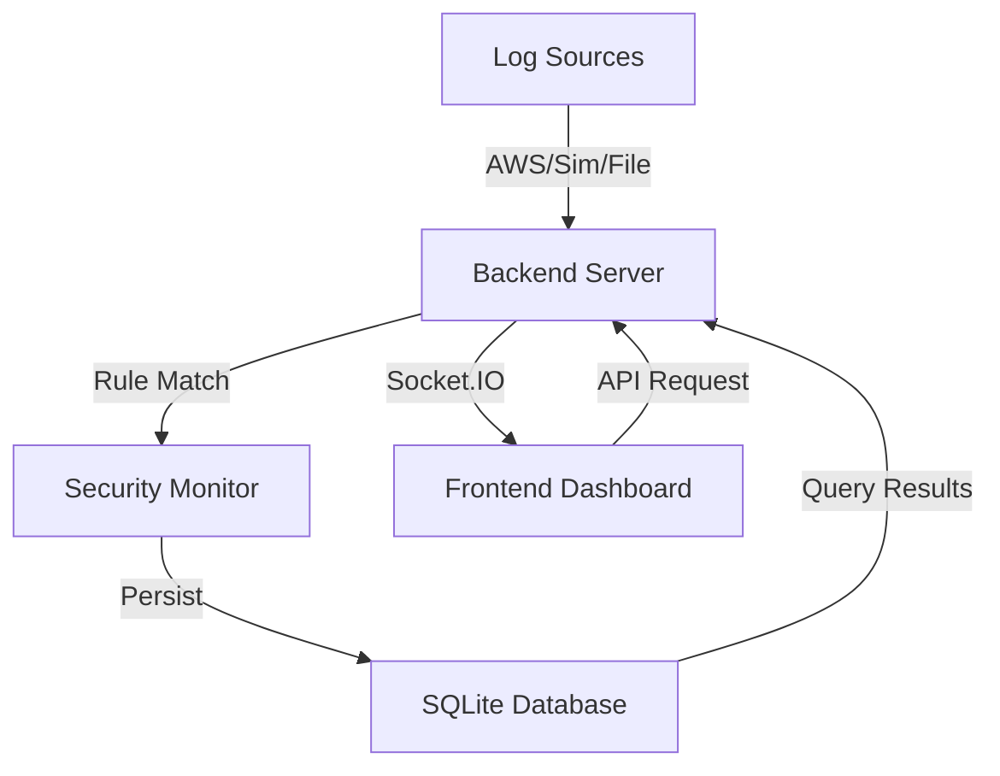

# System Architecture

Log-Sense is designed as a modular, real-time Security Operations Center (SOC) platform. It follows a decoupled frontend-backend architecture with a centralized data processing pipeline.

## 🏗️ Design Overview

- **Frontend**: A single-page application (SPA) built with **React** and **Vite**. It uses **Tailwind CSS** for styling and **Framer Motion** for animations.
- **Backend**: A **Node.js/Express** server that handles log ingestion, rule processing, and persistence.
- **Persistence**: **SQLite** (`better-sqlite3`) provides a lightweight, performant relational database.
- **Communication**: **Socket.IO** enables bidirectional, real-time communication for log streaming and alert notifications.

---

## 🔄 Data Flow (Log → Alert → Incident)

The system maintains strict relational integrity across the security pipeline:

1. **Ingestion**: Logs are received from the **Simulator**, a **Live AWS EC2** instance, or a **Forensic Upload**.
2. **Standardization**: Incoming events are parsed and normalized into a standard log schema.
3. **Detection (SecurityMonitor)**:
   - Each log is passed through the Rule Engine.
   - Heuristic rules (e.g., brute force thresholds, privilege escalation patterns) are applied.
4. **Alert Generation**: If a rule matches, a new **Alert** is created (or updated if an existing alert for the same vector is active).
5. **Incident Promotion**: High-risk alerts or persistent threats are automatically promoted to **Incidents**, grouping related events for investigation.

---

## 🛡️ Mode Separation

Log-Sense implements strict data isolation between three distinct operational modes:

- **🟢 Simulation Mode**: synthetic logs generated by the local simulator.
- **🔴 AWS Live Mode**: real-time logs fetched from an EC2 instance via SSH.
- **🟡 Forensic Mode**: offline logs uploaded by the user for post-mortem analysis.

Each mode operates on its own data subset (`source` column in DB). Switching modes clears the frontend state and redirects all API queries to the appropriate source, ensuring no cross-mode data leakage.

---

## 📊 Component Interaction

