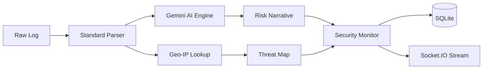
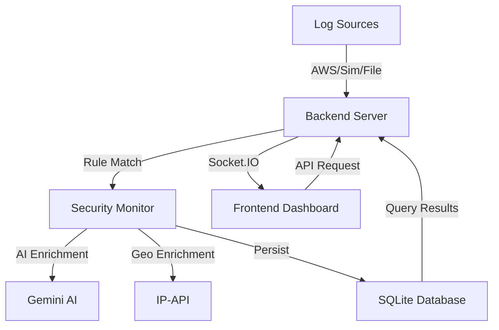

# System Architecture

Log-Sense is designed as a modular, real-time Security Operations Center (SOC) platform. It follows a decoupled frontend-backend architecture with a centralized data processing pipeline.

## 🏗️ Design Overview

- **Frontend**: A single-page application (SPA) built with **React** and **Vite**. It uses **Tailwind CSS** for styling and **Framer Motion** for animations.
- **Backend**: A **Node.js/Express** server that handles log ingestion, rule processing, and persistence.
- **Persistence**: **SQLite** (`better-sqlite3`) provides a lightweight, performant relational database.
- **Communication**: **Socket.IO** enables bidirectional, real-time communication for log streaming and alert notifications.

---

## 🔄 Data Flow (Log → Alert → Incident)

The system maintains strict relational integrity across the security pipeline:

1. **Ingestion**: Logs are received from the **Simulator**, a **Live AWS EC2** instance, or a **Forensic Upload**.
2. **Standardization**: Incoming events are normalized into a unified schema.
3. **Enrichment (Intelligence Pipeline)**:
   - **Geolocation**: IPs are cross-referenced with global threat databases.
   - **AI Context**: Gemini AI generates natural language explanations for the event risk.
4. **Detection (SecurityMonitor)**:
   - Logs are passed through the Heuristic Rule Engine.
   - **User Profiling**: Login patterns are compared against historical baselines.
5. **Alert & Incident Promotion**:
   - Matches trigger **Alerts** and increment IP-based **Risk Scores**.
   - Persistent or high-severity threats are promoted to **Incidents**.
   - **Attack Stories**: AI synthesizes sequences into a readable narrative for analysts.

---

## 🛰️ Intelligence Pipeline

---

## 🛡️ Autonomous Defense Flow

Log-Sense doesn't just monitor; it defends. When the `SecurityMonitor` detects a threshold breach (e.g., 5+ failed logins):
1. The IP is added to the `blocked_ips` table.
2. A `defense:block` signal is emitted via WebSockets.
3. Frontend components immediately visually flag subsequent traffic from that IP.
4. Integration logic allows for actual edge hardware/cloud-firewall blocking (Logic provided).

---

## 📊 Component Interaction

